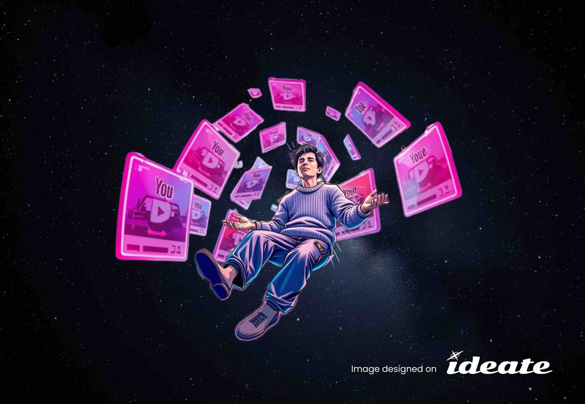
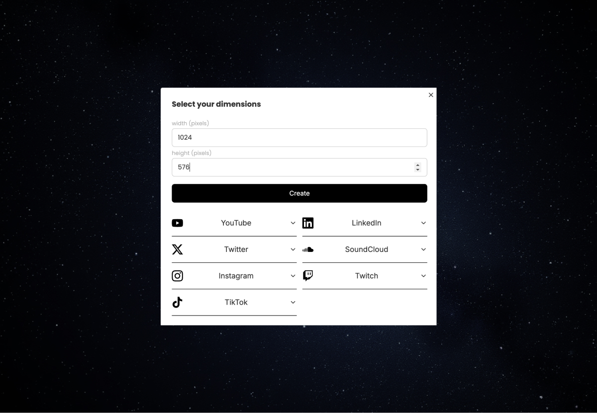
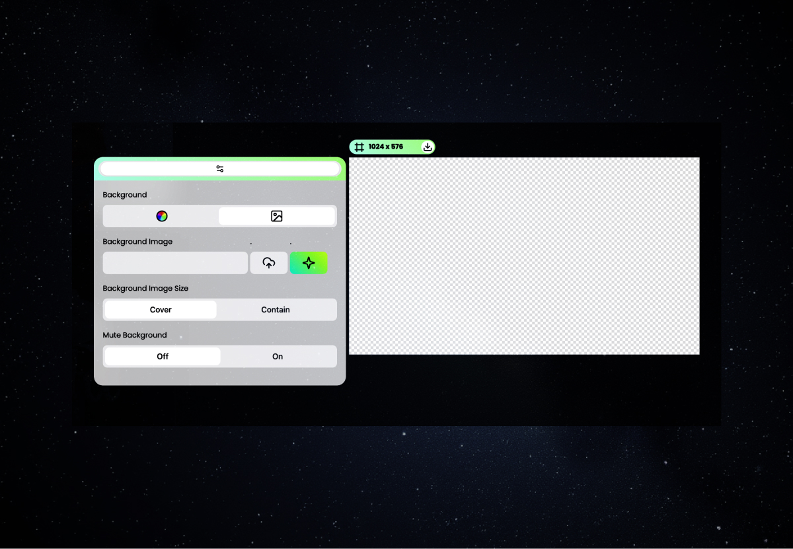
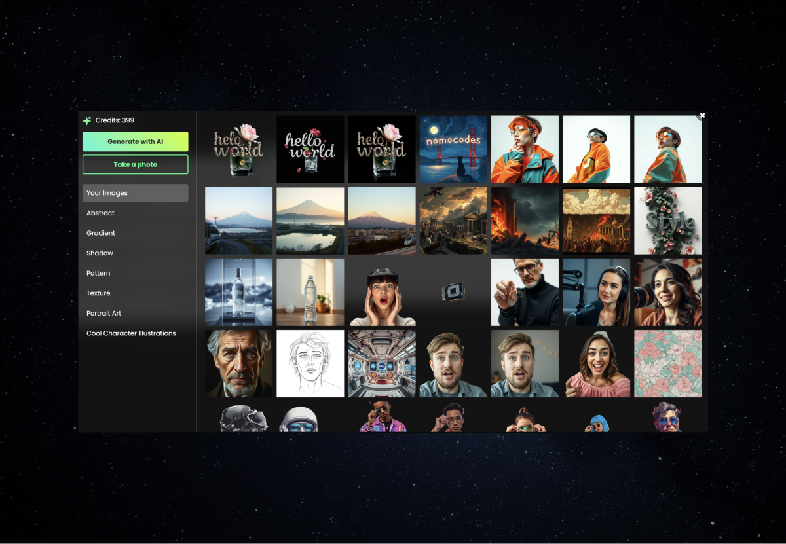
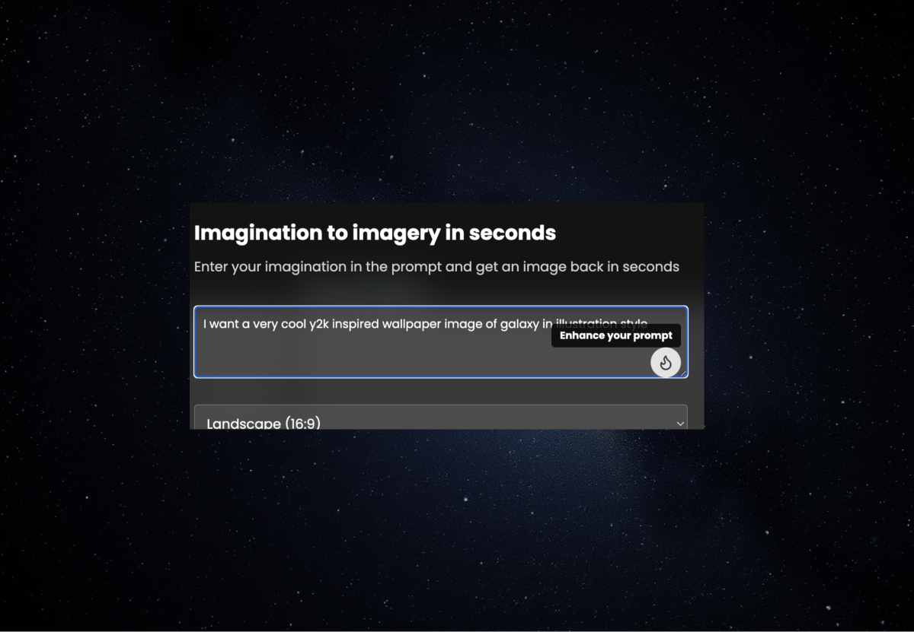
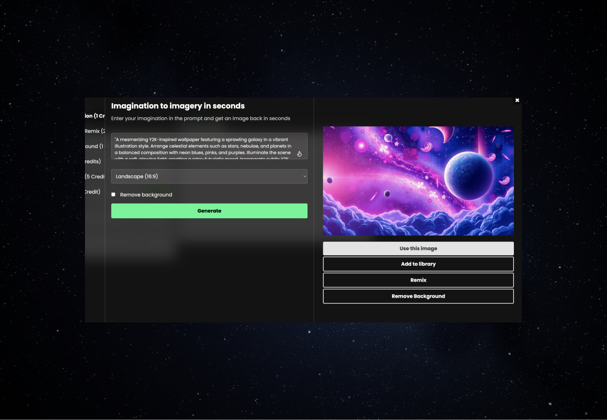
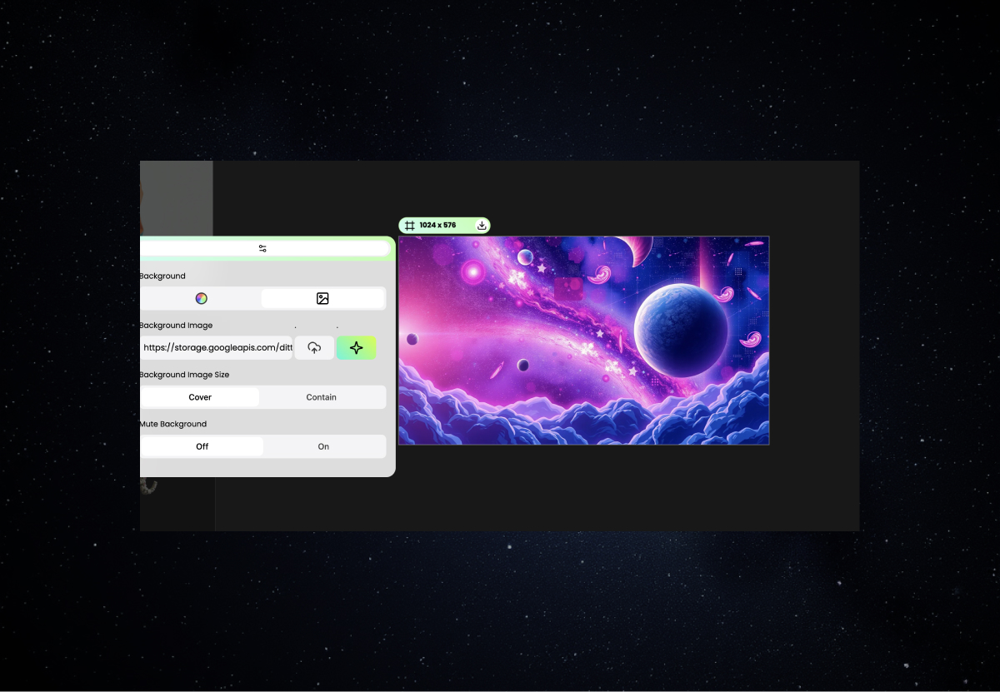

 

# How to Design a 1024x576 Pixels YouTube Banner Background Using ideate.xyz's Template

Are you struggling to create that perfect YouTube banner background? Look no further! In this guide, we'll show you how to effortlessly create a 1024x576 YouTube banner using ideate.xyz, an AI design copilot for content creation teams. With ideate.xyz's YouTube banner template, you can produce scroll-stopping designs in just a few clicks.

 

## Understanding YouTube Banner Size Specifications

Before we dive into the creation process, let's quickly review the essential YouTube banner size specifications:

- The ideal YouTube banner size is 1024x576 pixels
- This 1024 x 576 pixels YouTube banner ensures your design looks great on various devices
- While YouTube recommends 2560x1440 pixels for the safe area, a 1024x576 YouTube banner works well for most purposes

Now that we've covered the basics of YouTube banner size, let's create your stunning YouTube banner background!

 

## Step-by-Step Guide to Creating Your YouTube Banner with ideate.xyz

Follow these simple steps to design your YouTube banner background using ideate.xyz's powerful AI-driven YouTube banner template:

1. **Sign up for ideate.xyz**: Visit [ideate.xyz](https://ideate.xyz) and create an account if you haven't already.

2. **Create a new project**: Once logged in, start a new project and select "YouTube thumbnail" as your project type.

3. **Add a new frame**: Look for the bottom navigation bar and click to add a new frame.

4. **Select YouTube banner frame**: Enter dimension 1024x576 for your desired YouTube banner size.

5. **Design your background**: Click on the background area to open the image studio.

6. **Generate with Flux Schnell model**: we have integrated Flux Schnell model under the hood of our image library to help you generate unique and eye-catching backgrounds for your YouTube banner.

7. **Use image as frame background**: Select "Use Image" to add it right into your frame or simply generate another one until you are happy!

8. **Finalize your design**: Review your creation, make any necessary adjustments, and voila! Your professional-looking 1024x576 YouTube banner is ready. When you are happy, simply use the download button on the frame top bar to export the design!

 

## Best Practices for YouTube Banner Background Design

While using ideate.xyz's YouTube banner template makes the process incredibly easy, keep these best practices in mind:

1. **Maintain brand consistency**: Use colors and fonts that align with your channel's overall branding.

2. **Keep it simple**: Don't overcrowd your banner. Remember, less is often more.

3. **Consider all devices**: Ensure your main elements are visible in the "safe area" for various screen sizes.

4. **Use high-quality images**: The Flux Schnell model generates crisp images, perfect for your 1024x576 YouTube banner background.

5. **Update regularly**: Keep your banner fresh by updating it seasonally or when you hit major milestones.

 

## Get More from ideate.xyz's YouTube Banner Template

Creating stunning YouTube banners is just the beginning of what you can do with ideate.xyz. To get the most out of this powerful tool:

- Join our [Discord community](https://discord.com/invite/zN9vaHucpH) for tips, help and more free credits!!
- Get more free credits for image generation by participating in our community events and challenges.

Don't let a lackluster YouTube banner hold your channel back. With ideate.xyz's YouTube banner template and AI-powered tools, you can create professional, eye-catching 1024x576 YouTube banner designs in seconds. Start designing your perfect YouTube banner background today and watch your channel's visual appeal soar!

Remember, the key to a great YouTube banner background is creativity and consistency. Let ideate.xyz be your AI design copilot on this journey to creating scroll-stopping content for your channel.